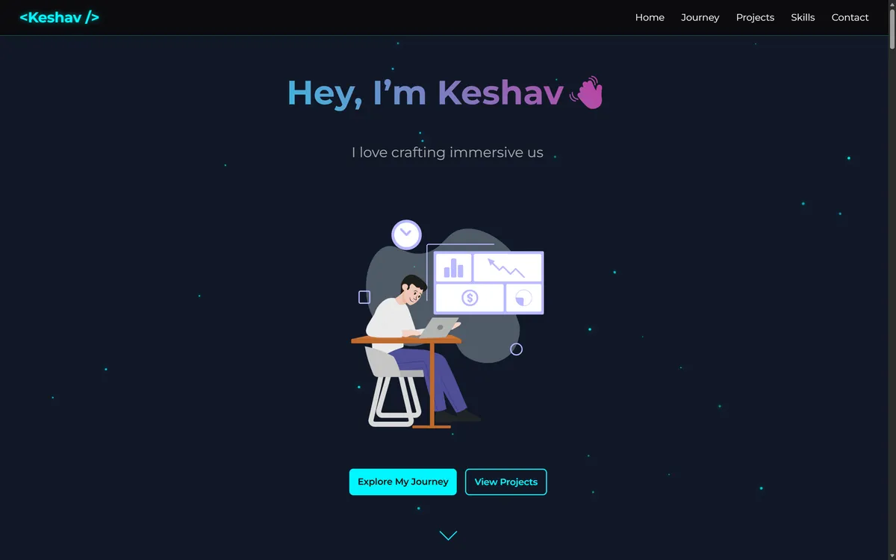
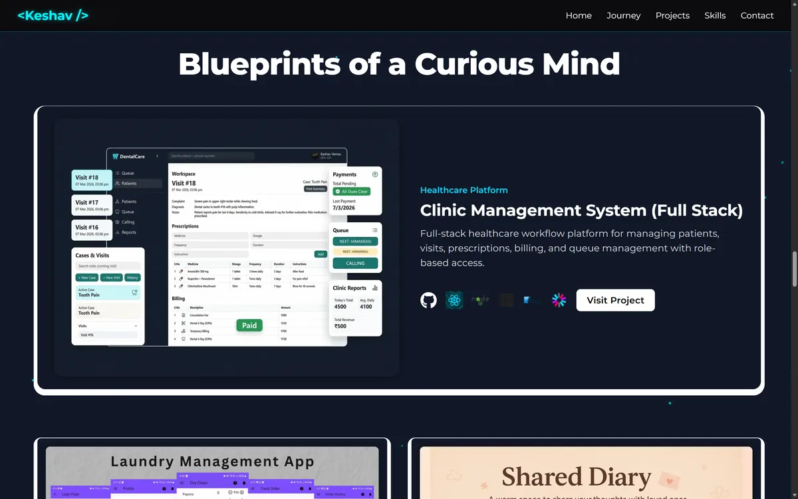
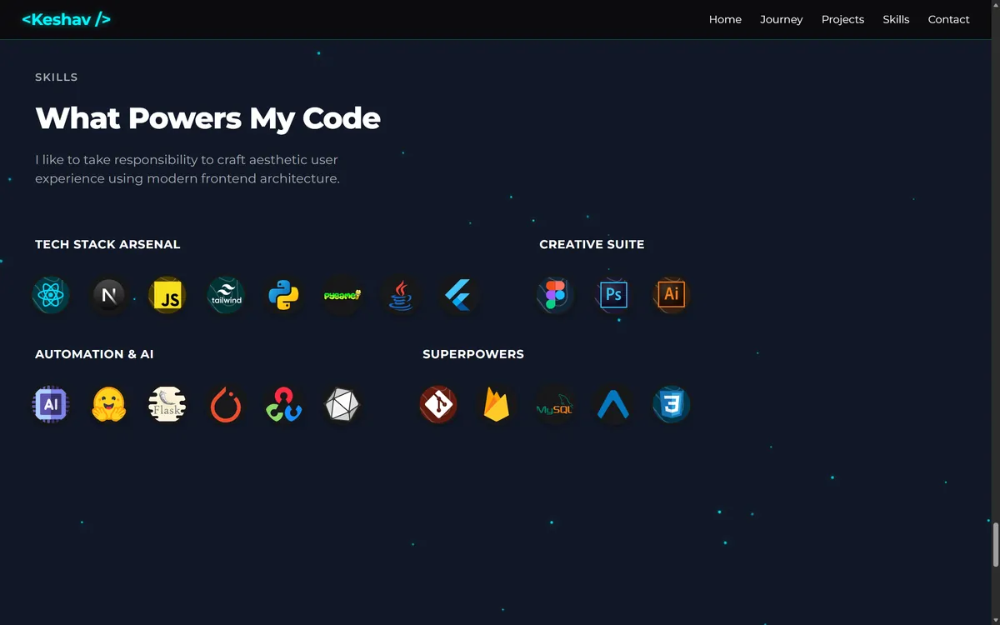
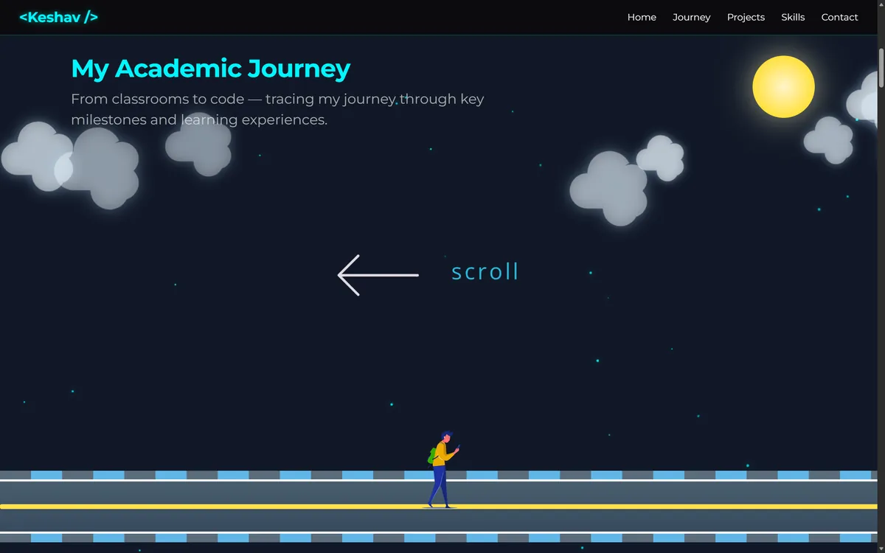
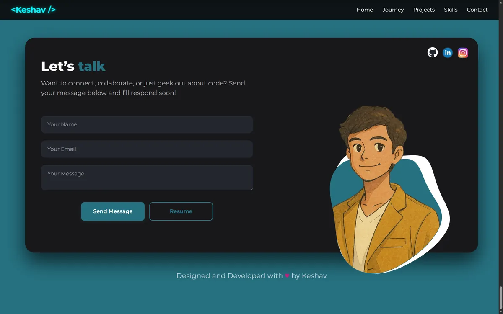

# 💻 Developer Portfolio

<p align="center">
A modern interactive developer portfolio showcasing projects, skills, and technical journey.
</p>

<p align="center">

[](https://my-portfolio-keshavs-projects-72997bdc.vercel.app/)


</p>

<p align="center">


</p>

A **personal developer portfolio website** built to showcase projects, technical skills, and the journey of learning software development.

The portfolio focuses on **interactive design, smooth animations, and immersive presentation**, allowing visitors to explore projects and skills in a visually engaging way.

🔗 **Live Portfolio**
[https://my-portfolio-keshavs-projects-72997bdc.vercel.app/](https://my-portfolio-keshavs-projects-72997bdc.vercel.app/)

---

# 📖 Project Overview

This portfolio acts as a **central hub for all development work**, including:

* full-stack systems
* AI & machine learning projects
* mobile applications
* computer vision systems
* experimental and learning projects

The goal of this project is to present development work in a **clean, professional, and interactive format** suitable for recruiters and collaborators.

The portfolio highlights:

* major projects with detailed descriptions
* developer skillset
* learning journey timeline
* contact information

---

# 📸 Portfolio Preview

### 🏠 Home Section

<p align="center">

</p>

The landing section introduces the developer and provides quick navigation across portfolio sections.

---

### 💼 Projects Section

<p align="center">

</p>

Displays all development projects including:

* Full-stack systems
* AI pipelines
* Mobile applications
* Computer vision projects
* experimental builds

Each project includes a **description, technology stack, GitHub link, and demo link when available**.

---

### 🧠 Skills Section

<p align="center">

</p>

Shows the developer's technology stack and tools used across different projects.

Technologies displayed include:

* programming languages
* frameworks
* AI libraries
* development tools

---

### 🧭 Developer Journey

<p align="center">

</p>

A timeline showing the developer's **learning journey**, including major milestones and technologies explored during the development career.

---

### 📬 Contact Section

<p align="center">

</p>

Provides ways to connect with the developer through social platforms and professional networks.

---

# ✨ Implemented Features

## 🎨 Interactive UI

The portfolio includes several interactive UI elements:

* animated project cards
* tilt hover effects
* smooth section transitions
* animated navigation

Animations are powered by **GSAP**.

---

## 💼 Project Showcase

The portfolio displays multiple projects including:

* **Clinic Management System (Full Stack)**
* **Laundry Management App**
* **AI Insight Pipeline**
* **Deep Adaptive Image Anonymizer**
* **Shared Diary Web App**
* **GO UP Game & AI Agent**

Each project card provides:

* project description
* technology stack
* GitHub repository link
* live demo (if available)

---

## 🧭 Developer Timeline

The timeline section presents the developer’s **technical evolution**, showing when major technologies and projects were learned or built.

The section is implemented using **HTML, SVG, and GSAP animations**.

---

## 📱 Fully Responsive Design

The portfolio layout adapts automatically for:

* desktop screens
* tablets
* mobile devices

Ensuring a smooth user experience across devices.

---

# 🛠 Technology Stack

## Frontend

* **React.js**
* **Next.js**
* **Tailwind CSS**

---

## Animations & Interaction

* **GSAP**
* **Tilt.js**

Used for:

* hover effects
* animation sequences
* dynamic UI transitions

---

## Deployment

* **Vercel**

---

# 🏗 System Architecture

```
User
 │
 ▼
Next.js Application
 │
 ▼
React Components
 │
 ├── Home Section
 ├── Projects Section
 ├── Skills Section
 ├── Journey Timeline
 └── Contact Section
 │
 ▼
Vercel Hosting
```

---

# 🚀 Running the Project Locally

### 1️⃣ Clone the Repository

```bash
git clone <YOUR_GIT_URL>
cd my-portfolio
```

---

### 2️⃣ Install Dependencies

```bash
npm install
```

---

### 3️⃣ Run Development Server

```bash
npm run dev
```

The application runs at:

```
http://localhost:3000
```

---

# 🎨 Design Inspiration

The UI design was inspired by award-winning developer portfolios and modern UI showcases.

Sources of inspiration include:

* [https://www.awwwards.com](https://www.awwwards.com)
* Ayush Singh's Portfolio
* Minimal Next.js Portfolio by codebucks27

These were used as **design inspiration while building a custom portfolio experience**.

---

# 👨‍💻 Author

**Keshav**

B.Tech Computer Science & Engineering
Bennett University

🔗 LinkedIn
[https://www.linkedin.com/in/keshav262004](https://www.linkedin.com/in/keshav262004)

---

# ⭐ Support

If you like this project, consider giving it a **star ⭐ on GitHub**.

---

# 📜 License

This project is open for learning and inspiration.
If you reuse parts of this portfolio, please provide proper attribution.

---